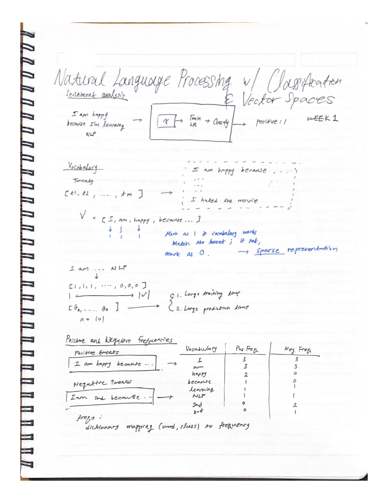
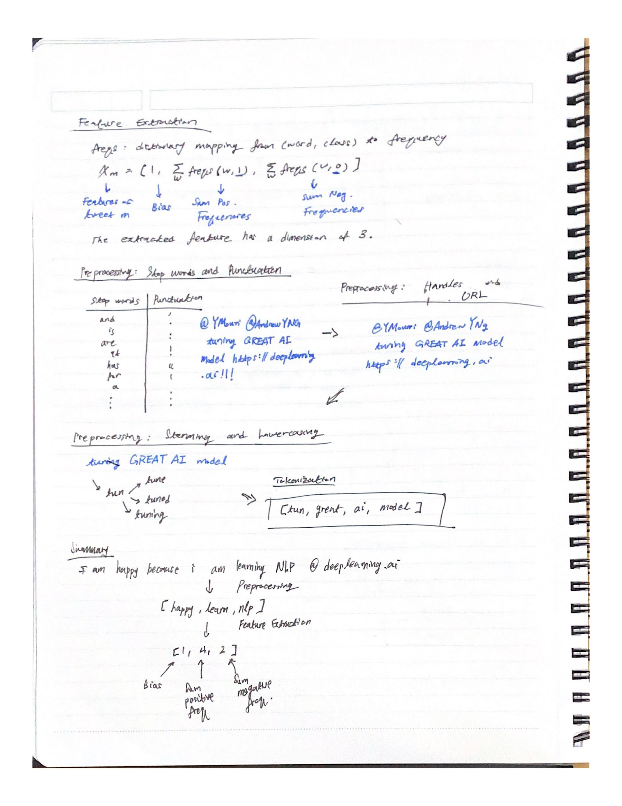
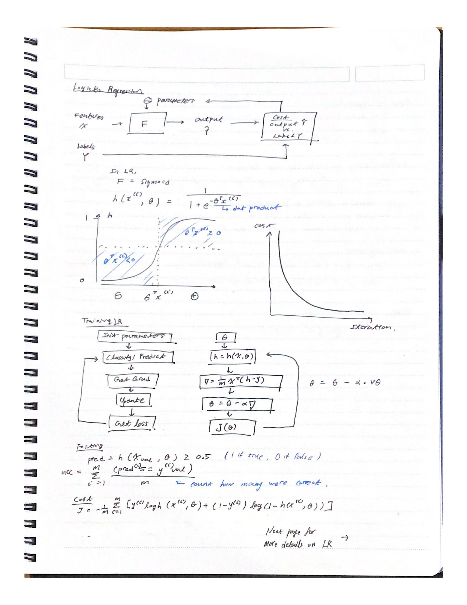
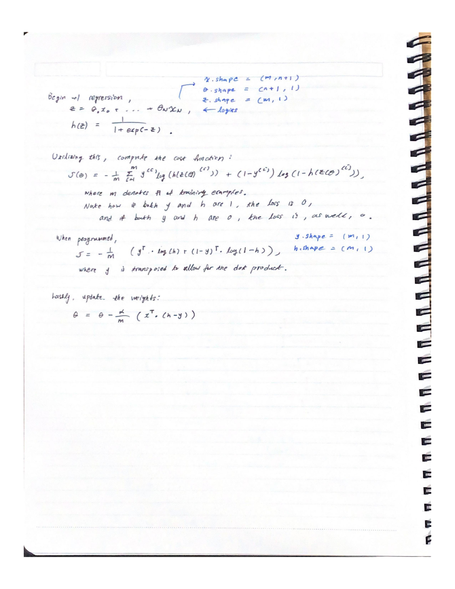

# Week 1

Wonderful, wonderful! Welcome to the first week of Natural Language Processing!

To read `.ipynb` notebooks, alas, visit the following links!

- [Natural Language Processing](src/notebook/C1_W1_lecture_nb_01_preprocessing.ipynb)
- [Word Frequencies](./src/notebook/C1_W1_lecture_nb_02_word_frequencies.ipynb)
- [Tweet Visualization & Logistic Regression](nlp/c1_nlp_classification_vector_spaces/w1/src/notebook/C1_W1_lecture_nb_03_logistic_regression_model.ipynb)

